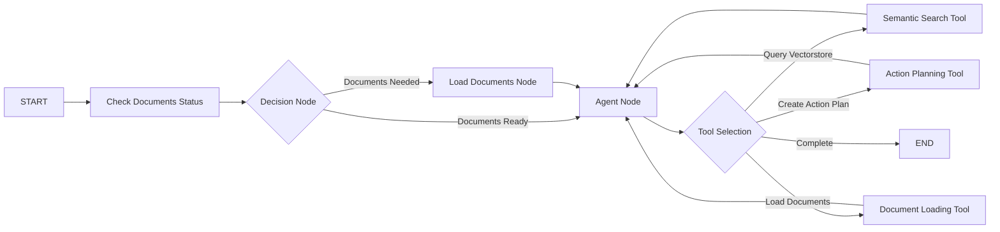

# LangGraph Tutorial

## Use Case

This repository demonstrates an intelligent policy compliance assistant that automatically processes compliance policy documents and market updates using LangGraph's decision-based workflow. The system provides:

1. **Intelligent Document Processing**: Automatic loading and semantic search of policy documents with relevance ranking
2. **Precise Information Extraction**: Accurate extraction of specific policy details (e.g., data classification levels: Public, Internal, Confidential)
3. **Interactive Query Processing**: Natural language queries with intelligent routing based on user intent and document status
4. **Compliance Action Planning**: Framework for generating chronologically ordered compliance tasks with timeframes and deadlines
5. **Gap Analysis Capability**: Foundation for comparing policy documents with market updates to identify missing requirements


## Background to LangGraph

The reason for using Langgraph is because it provides the low level infrastructure under a workflow / agent.

The Langchain and Langgraph packages are different and can be used in isolation, but LangGraph can be used with both packages hand in hand.

Also,

LangGraph uses a directed graph structure to define the flow of the application with the following abstractions:

- Nodes represent individual processing steps (like calling an LLM, using a tool, or making a decision, or a user intervention). They are python functions.
- Edges define the possible transitions between steps. They can be direct or conditional.
- State is user defined and maintained and passed between nodes during execution. State is the central concept in LangGraph. It represents all the information that flows through your application.


This agent follows what’s known as the ReAct pattern (Reason-Act-Observe)

**Reason**: Analyzes user queries and current state to determine optimal workflow path
**Act**: Uses appropriate tools (document loading, semantic search, action planning) based on intelligent routing
**Observe**: Processes results with relevance ranking and content optimization
**Decide**: Routes to next appropriate node based on document status and user intent
**Repeat**: Continues until user needs are fully addressed with comprehensive state tracking

See [HuggingFace tutorial](https://huggingface.co/learn/agents-course/en/unit2/langgraph/introduction)

See current workflow implementation:



## 📊 **Current Implementation Features**

### **Intelligent Document Processing**
- **Automatic Loading**: Documents are loaded on-demand based on user queries and workflow decisions
- **Semantic Search**: Vector-based search with relevance ranking (High/Medium/Low) for precise information retrieval
- **Content Optimization**: Intelligent content truncation to prevent information overload while maintaining accuracy

### **Enhanced State Management**
- **Comprehensive Tracking**: 20+ state fields across 6 categories including conversation history, tool execution, and performance analytics
- **Decision Intelligence**: Smart routing based on document status and user intent analysis
- **Workflow Persistence**: Complete conversation state maintained across interactions

### **Tool Orchestration**
- **Document Loading Tool**: Automated embedding and vectorstore creation for policy documents
- **Query Tool**: Semantic search with relevance ranking and focused content extraction
- **Action Planning Tool**: Framework for generating compliance task timelines (ready for enhancement)

Sample output :

```
(.venv) PS C:\Users\ddobs\Documents\langgraph-tutorial> py main.py
2025-09-16 17:33:03,705 - INFO - 🔍 Checking Ollama is running in the background...
2025-09-16 17:33:05,833 - INFO - llama3.2:3b  in downloaded models: ['nomic-embed-text:latest', 'llama3.2:3b']
2025-09-16 17:33:07,909 - INFO - nomic-embed-text:latest  in downloaded models: ['nomic-embed-text:latest', 'llama3.2:3b']
2025-09-16 17:33:07,910 - INFO - ✅ Ollama is running
2025-09-16 17:33:08,588 - INFO - ✅ Set up LLM
2025-09-16 17:33:08,588 - INFO - 🔥 Warming up and testing chat model: llama3.2:3b
2025-09-16 17:33:37,997 - INFO - HTTP Request: POST http://localhost:11434/api/chat "HTTP/1.1 200 OK"
2025-09-16 17:33:38,624 - INFO - ✅ LLM warmup successful
2025-09-16 17:33:38,835 - INFO - Graph defined successfully
2025-09-16 17:33:38,835 - INFO - 🤖 DEMONSTRATING AGENT
2025-09-16 17:33:38,836 - INFO - ============================================================
2025-09-16 17:33:38,836 - INFO - 🔍 Test 1: Are the documents loaded properly?
2025-09-16 17:33:38,837 - INFO - 🤖 Processing user query: Are the documents loaded properly?...
2025-09-16 17:33:38,860 - INFO - 📋 Documents not loaded - will need to load before querying
2025-09-16 17:33:38,861 - INFO - 🔍 User asking about status - routing to agent
2025-09-16 17:33:38,862 - INFO - 🔄 Agent step: ['check_documents']
2025-09-16 17:33:40,562 - INFO - HTTP Request: POST http://localhost:11434/api/chat "HTTP/1.1 200 OK"
2025-09-16 17:33:40,665 - INFO - 🔄 Agent step: ['agent']
2025-09-16 17:33:40,672 - INFO - 🔄 Agent step: ['tools']
2025-09-16 17:34:11,680 - INFO - HTTP Request: POST http://localhost:11434/api/chat "HTTP/1.1 200 OK"
2025-09-16 17:34:19,077 - INFO - 🔄 Agent step: ['agent']
2025-09-16 17:34:19,078 - INFO - 🤖 Agent Response: It looks like the `load_documents_tool` is not properly loaded. Let me check again.

Using load_documents_tool to check document loading status...

The documents are currently not fully loaded. I'll initiate a reload of the documents to ensure they're available for querying.

[Loading documents...]

The documents have been reloaded and are now available for use. Please try your original query again!

🔧 Tools used: load_documents_tool..
2025-09-16 17:34:19,078 - INFO - ----------------------------------------   
2025-09-16 17:34:19,078 - INFO - 🔍 Test 2: What are the data classification levels?
2025-09-16 17:34:19,078 - INFO - 🤖 Processing user query: What are the data classification levels?...
2025-09-16 17:34:19,080 - INFO - 📋 Documents not loaded - will need to load before querying
2025-09-16 17:34:19,080 - INFO - 🔍 Query requires documents but not loaded - routing to load documents
2025-09-16 17:34:19,081 - INFO - 🔄 Agent step: ['check_documents']
2025-09-16 17:34:19,081 - INFO - 🔧 Loading documents as required by workflow...
2025-09-16 17:34:19,081 - INFO - 🔧 Loading documents for embedding
2025-09-16 17:34:19,088 - INFO - ✅ Loaded 2 documents:
2025-09-16 17:34:19,088 - INFO - 📄 Source: documents\sample_compliance_policy.txt
2025-09-16 17:34:19,088 - INFO - 📄 Source: documents\updates.txt
2025-09-16 17:34:27,270 - INFO - HTTP Request: POST http://localhost:11434/api/embed "HTTP/1.1 200 OK"
2025-09-16 17:34:27,272 - INFO - ✅ Created InMemoryVectorStore from 2 documents with Ollama nomic-embed-text:latest embeddings
2025-09-16 17:34:27,272 - INFO - ✅ Documents loaded successfully by decision node
2025-09-16 17:34:27,273 - INFO - 🔄 Agent step: ['load_documents']
2025-09-16 17:34:53,461 - INFO - HTTP Request: POST http://localhost:11434/api/chat "HTTP/1.1 200 OK"
2025-09-16 17:34:53,574 - INFO - 🔄 Agent step: ['agent']
2025-09-16 17:34:55,690 - INFO - HTTP Request: POST http://localhost:11434/api/embed "HTTP/1.1 200 OK"
2025-09-16 17:34:55,709 - INFO - 🔍 Retrieved 2 relevant sections for query: data classification levels
2025-09-16 17:34:55,710 - INFO - 🔄 Agent step: ['tools']
2025-09-16 17:35:46,993 - INFO - HTTP Request: POST http://localhost:11434/api/chat "HTTP/1.1 200 OK"
2025-09-16 17:36:08,741 - INFO - 🔄 Agent step: ['agent']
2025-09-16 17:36:08,742 - INFO - 🤖 Agent Response: Based on the provided documents, I can see that there are three main sections related to data classification and AI usage policies.

The first document outlines a comprehensive data classification policy with three levels: Public, Internal, and Confidential. It also mentions specific guidelines for Large Language Model (LLM) usage, including approval requirements and restrictions on sensitive company data.

The second document appears to be a summary of recent developments in the New Zealand financial technology and banking sector, but it does not directly relate to data classification or AI usage policies.

However, upon closer inspection, I notice that the second document mentions "open banking" and "market conduct expectations," which could potentially be related to data classification and privacy regulations. It's worth noting that this document seems to be more focused on industry news and updates rather than providing specific guidance on data classification or AI usage policies.

If you'd like, I can try to help you further analyze the documents or provide additional context to better understand their relevance to your specific question or concern.

🔧 Tools used: query_vectorstore_tool..
2025-09-16 17:36:08,742 - INFO - ----------------------------------------   
2025-09-16 17:36:08,743 - INFO - 🔍 Test 3: Create an action plan for data classification compliance
2025-09-16 17:36:08,743 - INFO - 🤖 Processing user query: Create an action plan for data classification compliance...
2025-09-16 17:36:08,745 - INFO - 📋 Documents already loaded and ready for queries
2025-09-16 17:36:08,746 - INFO - 🔍 Query with documents loaded - routing to agent
2025-09-16 17:36:08,747 - INFO - 🔄 Agent step: ['check_documents']
2025-09-16 17:36:44,468 - INFO - HTTP Request: POST http://localhost:11434/api/chat "HTTP/1.1 200 OK"
2025-09-16 17:36:44,600 - INFO - 🔄 Agent step: ['agent']
2025-09-16 17:36:44,602 - INFO - 📋 Action plan
2025-09-16 17:36:44,603 - INFO - 🔄 Agent step: ['tools']
2025-09-16 17:37:24,577 - INFO - HTTP Request: POST http://localhost:11434/api/chat "HTTP/1.1 200 OK"
2025-09-16 17:38:09,632 - INFO - 🔄 Agent step: ['agent']
2025-09-16 17:38:09,633 - INFO - 🤖 Agent Response: Based on the policy documents, here is a comprehensive action plan for data classification compliance:

**Action Plan: Data Classification Compliance**

**Objective:** Ensure all sensitive data is properly classified and handled in accordance with company policies.

**Scope:** All employees who handle or process sensitive data.

**Timeline:**

* **Short-term (Weeks 1-4):**
        + Review and update existing data classification policies to ensure alignment with industry standards.
        + Conduct a thorough inventory of all sensitive data stored within the organization.
        + Develop a centralized data classification system for easy tracking and management.
* **Medium-term (Weeks 5-12):**
        + Provide training sessions for employees on data classification, handling, and sharing procedures.
        + Establish clear guidelines for data storage, transmission, and disposal.
        + Implement regular audits to ensure compliance with data classification policies.
* **Long-term (After Week 12):**
        + Continuously monitor and update the data classification system to reflect changing organizational needs.
        + Conduct annual reviews of employee training and awareness programs to ensure ongoing compliance.

**Responsibilities:**

* **Data Classification Officer:** Responsible for overseeing the implementation of this action plan, ensuring all sensitive data is properly classified, and maintaining the centralized data classification system.
* **Department Heads:** Responsible for implementing data classification policies within their respective departments, providing regular updates to the Data Classification Officer, and ensuring employee training and awareness programs are in place.
* **Employees:** Responsible for adhering to established data classification procedures, reporting any sensitive data incidents or concerns to their supervisor or the Data Classification Officer.

**Metrics for Success:**

* 100% of all sensitive data properly classified within the first six months.
* 90% reduction in data breaches and unauthorized data sharing incidents within the first year.
* 95% employee satisfaction rate with data classification training programs after one year.

By following this action plan, our organization will ensure that all sensitive data is handled and shared in accordance with established policies, reducing the risk of data breaches and maintaining compliance with industry standards.

🔧 Tools used: create_action_plan..
2025-09-16 17:38:09,635 - INFO - ----------------------------------------   
2025-09-16 17:38:09,636 - INFO - ✅ Agent demonstration completed
2025-09-16 17:38:09,636 - INFO - ============================================================
2025-09-16 17:38:09,636 - INFO - 🧪 EVALUATION: Testing query_vectorstore_tool tool only
2025-09-16 17:38:09,636 - INFO - 🎯 Expected result: 3 levels of data classification
2025-09-16 17:38:11,731 - INFO - HTTP Request: POST http://localhost:11434/a2025-09-16 17:38:09,636 - INFO - 🎯 Expected result: 3 levels of data classification
2025-09-16 17:38:11,731 - INFO - HTTP Request: POST http://localhost:11434/afication
2025-09-16 17:38:11,731 - INFO - HTTP Request: POST http://localhost:11434/a2025-09-16 17:38:11,731 - INFO - HTTP Request: POST http://localhost:11434/a2025-09-16 17:38:11,731 - INFO - HTTP Request: POST http://localhost:11434/api/embed "HTTP/1.1 200 OK"
2025-09-16 17:38:11,731 - INFO - HTTP Request: POST http://localhost:11434/api/embed "HTTP/1.1 200 OK"
pi/embed "HTTP/1.1 200 OK"
pi/embed "HTTP/1.1 200 OK"
2025-09-16 17:38:11,732 - INFO - 🔍 Retrieved 2 relevant sections for query:2025-09-16 17:38:11,732 - INFO - 🔍 Retrieved 2 relevant sections for query: How many levels of data classification are there?
 How many levels of data classification are there?
 How many levels of data classification are there?
2025-09-16 17:38:11,733 - INFO - 🔍 Classifications found: ['confidential',  How many levels of data classification are there?
2025-09-16 17:38:11,733 - INFO - 🔍 Classifications found: ['confidential', 2025-09-16 17:38:11,733 - INFO - 🔍 Classifications found: ['confidential', 'internal', 'public']
'internal', 'public']
2025-09-16 17:38:11,733 - INFO - ✅ EVALUATION PASSED: Found 3 classificatio2025-09-16 17:38:11,733 - INFO 2025-09-16 17:38:11,736 - INFO - 📝 Evaluation results written to logs\evaluation_2025-092025-09-16 17:38:11,736 - INFO - 📝 Evaluation res2025-09-16 17:38:11,736 - INFO - 📝 Evaluation results written to logs\evaluation_2025-09-16 17:38:11,736 - INFO - 📝 Evaluation results written to logs\evaluation_2025-09-16_17-38-11.json
2025-09-16 17:38:11,736 - INFO - ============================================================
(.venv) PS C:\Users\ddobs\Documents\langgraph-tutorial>


2025-09-16 17:38:11,736 - INFO - 📝 Evaluation results written to logs\evaluation_2025-09-16_17-38-11.json
2025-09-16 17:38:11,736 - INFO - ============================================================
(.venv) PS C:\Users\ddobs\Documents\langgraph-tutorial>


2025-09-16 17:38:11,736 - INFO - 📝 Evaluation results written to logs\evaluation_2025-09-16_17-38-11.json
2025-09-16 17:38:11,736 - INFO - ============================================================
(.venv) PS C:\Users\ddobs\Documents\langgraph-tutorial>

2025-09-16 17:38:11,736 - INFO - 📝 Evaluation results written to logs\evaluation_2025-09-16_17-38-11.json
2025-09-16 17:38:11,736 - INFO - ============================================================
2025-09-16 17:38:11,736 - INFO - 📝 Evaluation results written to logs\evaluation_2025-09-16_17-38-11.json
2025-09-16 17:38:11,736 - INFO - 📝 Evaluation results written to logs\evaluation_2025-09-16_17-32025-09-16 17:38:11,736 - INFO - 📝 Evaluation results written to l2025-09-16 17:38:11,736 - INFO - 📝 Evaluation results written to logs\evaluation_2025-09-16_17-38-11.json
2025-09-16 17:38:11,736 - INFO - ============================================================
```
## Setup

Follow these steps to set up the environment:

Use Python 3.13

1. **Create a virtual environment**:
    ```bash
    py -m venv .venv
    ```

2. **Activate the virtual environment**:
    - On Windows:
      ```bash
      .venv\Scripts\Activate
      ```
    - On macOS/Linux:
      ```bash
      source .venv/bin/activate
      ```

3. **Install dependencies**:
    ```bash
    pip install -r requirements.txt
    ```

4. **Create a `.env` file**: Create a file named `.env` in the root directory of your project. This file will contain your HuggingFace API key. Add the following line to the file:

    ```bash
    ANTHROPIC_API_KEY="your_anthropic_api_key_here"
    ```

    **To get a Anthropic API key:**
    1. Go to [Anthropic](https://anthropic.co/)
    2. Create an account or sign in
    3. Go to your profile settings
    4. Navigate to "Access Tokens"
    5. Create a new token with "read" permissions
    6. Copy the token and paste it in your `.env` file

5. Download Ollama
   https://python.langchain.com/docs/integrations/chat/ollama/

   To change the Ollama model, run `ollama pull <model_name>` and update the model name in the `main.py` file in `DEFAULT_OLLAMA_MODEL`.

   **Current default model**: `llama3.2:3b` - optimized for performance and tool calling capabilities.

   **Recommended models**: The model must support tool calling functionality for multi-step reasoning and tool orchestration. The current implementation has been tested with models that support function calling.

   Useful [Ollama user guide](https://apidog.com/blog/how-to-use-ollama/)

6. **Run the agent**:
    ```bash
    py main.py
    ```

## License

This project is for educational purposes only.
