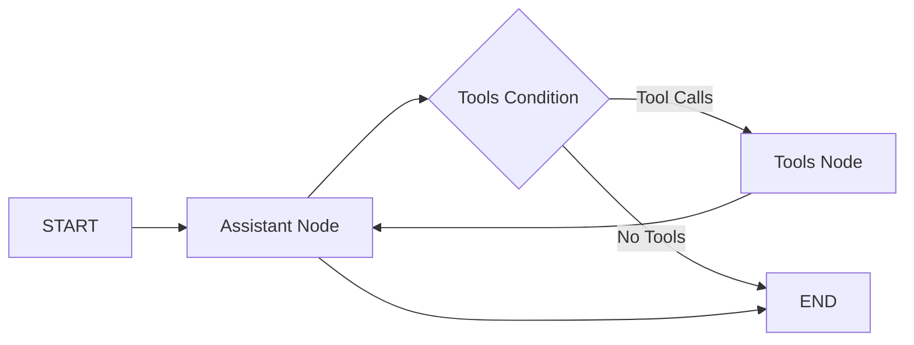

# LangGraph Tutorial - Policy Compliance Assistant

## 🎯 Use Case

This repository demonstrates a **modern LangGraph-powered policy compliance assistant** with a clean, modular architecture. The system showcases advanced AI workflow patterns using local LLMs for document processing and compliance analysis.

### 🚀 **Key Features**

1. **🏗️ Modular Architecture**: Clean separation of concerns with `src/agent/` structure
2. **📄 Intelligent Document Processing**: Automatic loading and semantic search with vector embeddings
3. **🔍 Precise Information Extraction**: Accurate extraction of policy details (e.g., data classification levels)
4. **🤖 Stateful Workflows**: LangGraph StateGraph with proper state management and tool integration
5. **🔧 Tool Orchestration**: Function-based tools with validation and error handling
6. **🏠 Local AI**: All processing runs locally using Ollama for privacy and cost efficiency
7. **✅ Comprehensive Testing**: Built-in evaluation framework for quality assurance


## 🏗️ **New Architecture Overview**

### **Modular Structure**
```
src/agent/
├── graph.py           # Main LangGraph StateGraph definition
├── utils.py           # Utility functions (LLM setup, validation, document loading)
├── evaluation_utils.py # Comprehensive testing framework
└── system_prompt.txt  # External system prompt for easy modification
```

### **LangGraph Workflow**
The new architecture uses a simplified, linear workflow:



### **Key Architectural Benefits**
- **🧩 Modular Design**: Clean separation of graph definition, utilities, and evaluation
- **📝 Type Safety**: Proper TypedDict usage for state management
- **🔧 Function-Based Tools**: Simple, testable tool implementations
- **✅ Startup Validation**: Comprehensive service and model checking
- **🧪 Built-in Testing**: Evaluation framework for continuous quality assurance

### **LangGraph Core Concepts**
- **Nodes**: Python functions that process state (assistant, tools)
- **Edges**: Define transitions between processing steps
- **State**: TypedDict that flows through the entire workflow
- **Tools**: Function-based implementations with proper error handling

## 📊 **Current Implementation Features**

### **🔧 Tool Implementation**
- **`load_documents_tool`**: Loads documents and creates vector embeddings with global state management
- **`query_documents_tool`**: Performs semantic search with vector similarity and returns formatted results
- **`assistant`**: Main LLM node with proper error handling and tool orchestration

### **📝 State Management**
- **`AgentState` TypedDict**: Clean state structure with proper type hints
  - `messages`: Annotated message list with `add_messages`
  - `ollama_validated`: Startup validation status
  - `documents_loaded`: Document loading status
  - `tool_calls`: Tool execution tracking

### **🚀 Workflow Features**
- **Startup Validation**: Comprehensive Ollama service and model availability checking
- **Error Handling**: Graceful failure modes with informative error messages
- **Tool Integration**: Seamless LLM tool binding with function-based implementations
- **Vector Search**: Functional document querying with similarity search

### **🚀 Quick Start Example**

```bash
# Run the new graph structure
langgraph dev
```

### **📊 Sample Workflow**
1. **Startup Validation**: Checks service and model availability
2. **Document Loading**: Automatically loads and embeds policy documents
3. **Query Processing**: Semantic search through document content
4. **Response Generation**: LLM processes results and generates responses
5. **Evaluation**: Built-in testing validates system performance

### **🎯 Expected Results**
- **Document Loading**: Successfully processes `.txt` files from `documents/` directory
- **Vector Search**: Functional similarity search with proper result formatting
- **Information Extraction**: Correctly identifies data classification levels (Public, Internal, Confidential)
- **Tool Integration**: Seamless LLM-tool interaction with proper state management

## 🛠️ Setup
### **📋 Prerequisites**
1. **Python 3.13+**: Required for modern type hints and performance
2. **Local LLM Service**: Install and run Ollama with required models
3. **Dependencies**: Install Python packages via requirements.txt

## Setup

Follow these steps to set up the environment:

Use Python 3.13

1. **Install Ollama and Models**:
   ```bash
   # Install Ollama (visit https://ollama.ai for platform-specific instructions)
   ollama pull llama3.2:3b
   ollama pull nomic-embed-text:latest
   ```

2. **Create a virtual environment**:
    ```bash
    py -m venv .venv
    ```

3. **Activate the virtual environment**:
    - On Windows:
      ```bash
      .venv\Scripts\Activate
      ```
    - On macOS/Linux:
      ```bash
      source .venv/bin/activate
      ```

4. **Install dependencies**:
    ```bash
    pip install -r requirements.txt
    ```

## 🧪 **Testing & Evaluation**

The system includes comprehensive testing:
- **Automated Tests**: `test_evaluation.py` validates system functionality
- **Quality Metrics**: Tests information extraction accuracy
- **Performance Monitoring**: Tracks response times and success rates
- **Detailed Logging**: Results saved to `logs/` directory

### **Adding Documents**
Place `.txt` files in the `documents/` directory. The system will automatically load and embed them.

### **System Prompt**
Edit `src/agent/system_prompt.txt` to customize agent behavior.

## License

This project is for educational purposes only.
