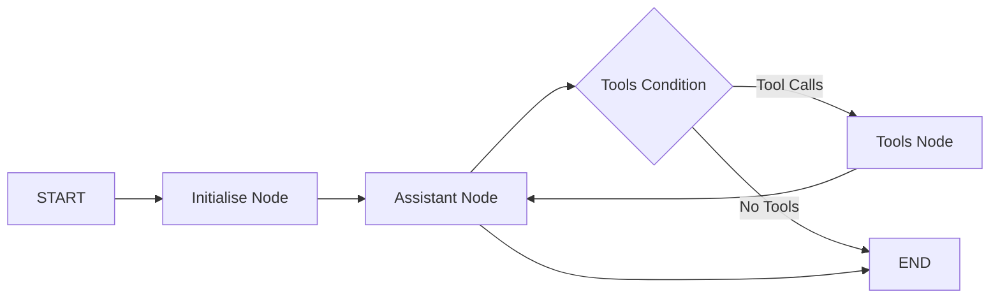

# LangGraph Tutorial - Policy Compliance Assistant

## 🎯 Use Case

This repository demonstrates a **LangGraph-powered policy compliance assistant**.The system showcases workflow patterns using **offline, local LLMs** for document processing and compliance analysis.

### 🚀 **Key Features**

1. **UI Interface**: Agent with conversational UI using [LangGraph Studio](https://github.com/langchain-ai/langgraph-studio) which also acts as an IDE.
2. **📄 Internal Document Processing**: Automatic loading and semantic search with vector embeddings using LangGraph in memory VectorStore
4. **🤖 Stateful Workflows**: LangGraph StateGraph with state management, memory and tool integration
5. **🔧 Tool Orchestration**: Function-based tools with validation and error handling
6. **🏠 Local Processing**: All processing runs locally using Ollama and downloaded LLMs for privacy and cost efficiency. There are no external API calls eg to Langraph API.

### **File Structure**

```
src/agent/
├── graph.py           # Main LangGraph StateGraph definition
├── utils.py           # Utility functions (LLM setup, validation, document loading)
├── evaluation_utils.py # Comprehensive testing framework
└── system_prompt.txt  # External system prompt for easy modification
```

### **LangGraph Workflow**

The system implements a ReAct (Reasoning-Action) workflow pattern:
- **Reasoning**: The agent analyzes the current state and user request
- **Action**: Executes appropriate tools based on reasoning
- **Observation**: Processes tool outputs and updates state
- **Decision**: Determines next steps (continue with tools or provide final response)

This cycle ensures systematic problem-solving with clear decision points and state tracking.



### **LangGraph Core Concepts**
- **Nodes**: Python functions that process state (assistant, tools)
- **Edges**: Define transitions between processing steps
- **State**: TypedDict that flows through the entire workflow
- **Tools**: Function-based implementations with proper error handling

## 📊 **Current Implementation Features**

### **🔧 Tool Implementation**
- **`load_documents_tool`**: Loads documents and creates vector embeddings with global state management
- **`query_documents_tool`**: Performs semantic search with vector similarity and returns formatted results
- **`assistant`**: Main LLM node with proper error handling and tool orchestration

### **📝 State Management**
- **`AgentState` TypedDict**: Clean state structure with proper type hints
  - `messages`: Annotated message list with `add_messages`
  - `ollama_validated`: Startup validation status
  - `documents_loaded`: Document loading status
  - `tool_calls`: Tool execution tracking

### **🚀 Quick Start Example**

```bash
# Run the graph structure
langgraph dev
```

```bash
# Run the evaluation suite
python src/agent/evaluation_utils.py
```

## 🛠️ Setup
### **📋 Prerequisites**
1. **Python 3.13+**: Required for modern type hints and performance
2. **Local LLM Service**: Install and run Ollama with required models
3. **Dependencies**: Install Python packages via requirements.txt

## Setup

Follow these steps to set up the environment:

Use Python 3.13

1. **Install Ollama and Models**:
   ```bash
   # Install Ollama (visit https://ollama.ai for platform-specific instructions)
   ollama pull llama3.2:3b
   ollama pull nomic-embed-text:latest
   ```

2. **Create a virtual environment**:
    ```bash
    py -m venv .venv
    ```

3. **Activate the virtual environment**:
    - On Windows:
      ```bash
      .venv\Scripts\Activate
      ```
    - On macOS/Linux:
      ```bash
      source .venv/bin/activate
      ```

4. **Install dependencies**:
    ```bash
    pip install -r requirements.txt
    ```

### **Adding Documents**
Place `.txt` files in the `documents/` directory. The system will automatically load and embed them.

### **System Prompt**
Edit `src/agent/system_prompt.txt` to customize agent behavior.

## License

This project is for educational purposes only.
